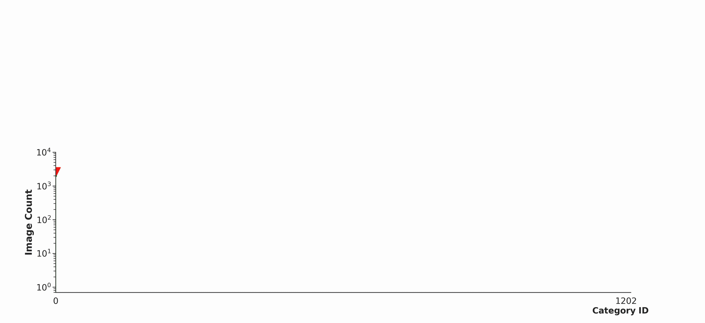

# [SimLTD: Simple Supervised and Semi-Supervised Long-Tailed Object Detection](https://arxiv.org/abs/2412.20047)

[](https://paperswithcode.com/sota/object-detection-on-lvis-v1-0-val?p=simltd-simple-supervised-and-semi-supervised)

<p align="center">
   
</p>

## Get Started
1. Please refer to this [installation guide](https://github.com/lexisnexis-risk-open-source/simltd/blob/main/docs/installation/).
2. Reproduce the results in Table 2 of our [CVPR 2025 paper](https://arxiv.org/abs/2412.20047) using the provided [reference configs](https://github.com/lexisnexis-risk-open-source/simltd/tree/main/configs/simltd).

## License
We release SimLTD under the permissive Apache 2.0 license. Any contributions made will also be subject to the same licensing.

Copyright 2025 LexisNexis Risk Solutions. All Rights Reserved.

## Acknowledgments
We are grateful for the open-source contributions from 

* [PyTorch](https://pytorch.org/)
* [OpenMMLab MMDetection](https://github.com/open-mmlab/mmdetection)
* [MixPL](https://github.com/Czm369/MixPL)

## Citation
If you find this work useful, consider citing the related paper:

```
@inproceedings{TranSimLTD,
  title="{SimLTD: Simple Supervised and Semi-Supervised Long-Tailed Object Detection}",
  author={Phi Vu Tran},
  booktitle={IEEE/CVF Conference on Computer Vision and Pattern Recognition (CVPR)},
  year={2025}
}
```
